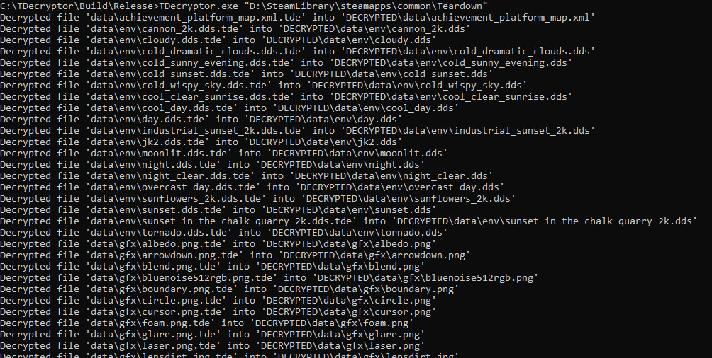
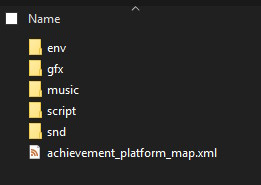
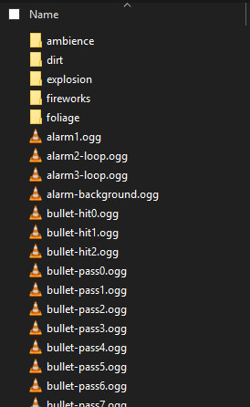

# TDecryptor
An Automatic Teardown .tde File Decryptor

# How to Use

- Open a command line (CMD) and navigate to the directory where TDecryptor.exe is located (e.g. TDecryptor/Build/Release/)
- Type in: TDecryptor.exe "path/to/Teardown/" and hit enter (**Replace 'path/to/Teardown/' with your actual Teardown installation path!**).
- The program will now create a directory called "DECRYPTED" at the root of your Teardown installation

  and proceed to find, decrypt and dump all encrypted .tde files into that directory.

  It also keeps the directory structure of these files, allowing for easy browsing and finding specific files.

**Example:**

If Teardown is installed at `D:\SteamLibrary\steamapps\common\Teardown\`

Run: `TDecryptor.exe "D:\SteamLibrary\steamapps\common\Teardown\"`

Decrypted files are then written to `D:\SteamLibrary\steamapps\common\Teardown\DECRYPTED\`

# Compiling From Source

To compile from source, you need a compiler with C++ 20 support and make sure the `codecvt` depreciation preprocessor definitions are set.

Other VS versions and/or compilers might work but I have not tested this.

# Notes

TDecryptor was tested to be fully working with the latest Teardown version at the time it was created (1.5.2).

If the decryptor breaks in a future update, I will likely not update it myself, though I might accept pull requests.

The code quality is probably not perfect but it works, so...
